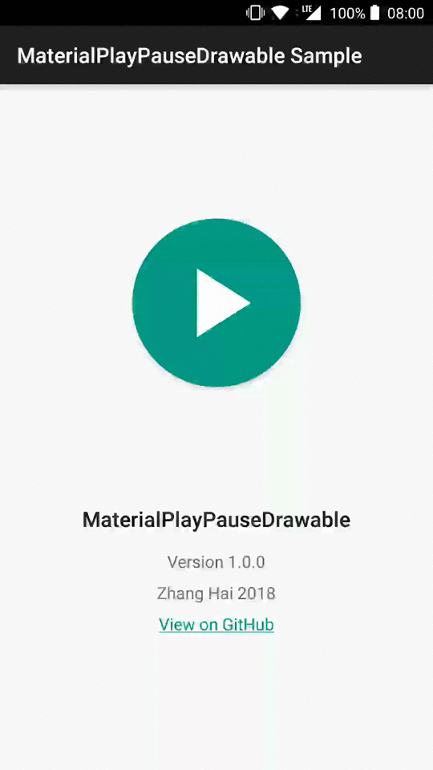

# MaterialPlayPauseDrawable


Material Design play/pause Drawable with animation, compatible with Android 4.0+.

## Why MaterialPlayPauseDrawable?

- Correct play icon that is the same as the one in Material Design Icons, not horizontally stretched.
- Robust state handling that always animates to the correct final state without visual glitch.
- Can be used flexibly as `Drawable`, `ImageView` or `ImageButton`.
- `Drawable` comes with the intrinsic size of 24dp.
- Compatible down to Android 4.0.

## Preview

<a href="https://play.google.com/store/apps/details?id=me.zhanghai.android.materialplaypausedrawable.sample" target="_blank"></a>

[Sample APK](//github.com/DreaminginCodeZH/MaterialPlayPauseDrawable/releases/download/v1.0.0/sample-release.apk)



## Integration

Gradle:

```gradle
compile 'me.zhanghai.android.materialplaypausedrawable:library:1.0.0'
```

## Usage

### As `ImageView` or `ImageButton`

Simply use `MaterialPlayPauseView` (subclass of `ImageView`) or `MaterialPlayPauseButton` (subclass of `ImageButton`), e.g.

```xml
<me.zhanghai.android.materialplaypausedrawable.MaterialPlayPauseButton
    android:id="@+id/play_pause"
    android:layout_width="wrap_content"
    android:layout_height="wrap_content"
    android:tint="?colorAccent" />
```

The `Drawable` is by default black, so you might want to tint it with `android:tint`. The default size will be determined by the `Drawable` which will be `24dp`.

Some interesting methods include `setAnimationDuration()`, `getState()`, `setState()` and `jumpToState()`, which you can use to control the play/pause state of the `Drawable`.

Implementation detail: The `Drawable` actually internally holds up to three states, namely the previous, current and next state. Animation happens between the previous and current state, and the next state is used to save the upcoming state while animation is running. If `setState()` is called while animation is running, it will simply replace the next state so that when current animation ends it can seamlessly transition to the final state without a glitch, while discarding any intermediate states. (And just to make things clear, `getState()` always returns the most recent state set by `setState()`.)

(This library is using `State.PLAY` and `State.PAUSE` to denote the two icons instead of using a `boolean`, because the latter can actually be confusing when `isPlaying == true` actually means showing a pause icon.)

### As `Drawable`

You can also use the `MaterialPlayPauseDrawable` directly. It has an intrinsic size of `24dp` and default color of black. It also exposed the same methods namely `setAnimationDuration()`, `getPlayPauseState()` (renamed to avoid clashing with `Drawable.getState()`), `setState()` and `jumpToState()`.

One caveat is that on Android 7.0+, the framework uses `View.onVisibilityAggregated()` instead of `View.onVisibilityChanged()`, and it is broken in that it won't set our Drawable to invisible when the containing view is set to invisible before attached to the view hierarchy (e.g. when inside `onBindViewHolder()`). This can lead to erroneous animation when the view is later set to visible because our `Drawable` won't be able to skip its animation when it was invisible.

To work around this issue, I created `VisibilityAggregatedImageView` and `VisibilityAggregatedImageButton`, and you might want to use or derive from them when using the `Drawable` directly. (If you are using `MaterialPlayPauseView` or `MaterialPlayPauseButton`, this is automatically handled for you.)

## License

    Copyright 2018 Zhang Hai

    Licensed under the Apache License, Version 2.0 (the "License");
    you may not use this file except in compliance with the License.
    You may obtain a copy of the License at

       http://www.apache.org/licenses/LICENSE-2.0

    Unless required by applicable law or agreed to in writing, software
    distributed under the License is distributed on an "AS IS" BASIS,
    WITHOUT WARRANTIES OR CONDITIONS OF ANY KIND, either express or implied.
    See the License for the specific language governing permissions and
    limitations under the License.
